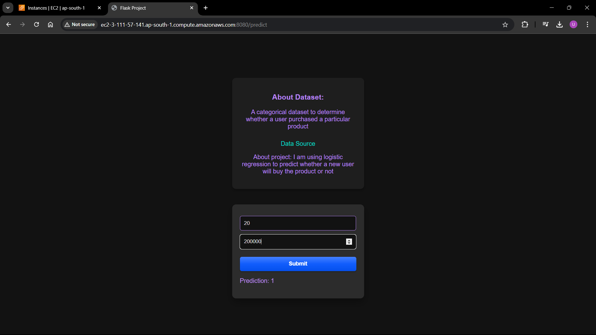

# This is a Basic Machine Learning Project 
## Deploying ML project for the first time on AWS
### This is a very basic logistic regression model
Main aim is to deploy on AWS  
I had used <a href="https://www.kaggle.com/datasets/rakeshrau/social-network-ads">this </a> data and applied **Logistic Regression** to predict whether a customer will buy my product or not.  
I had downloaded my model(You can view code <a href="https://github.com/Upeshjeengar/flask-basic-project/blob/main/3_LogisticRegression.ipynb">here</a>) using **pickel** and imported it to use.

  

## Documentation:
__tools used-__
__steps:__
1. create an **EC2 instance** using AWS console.
2. Download keypair value(putty file)
3. Download **putty**(for running terminal locally) and **WinSCP** to directly transfer files from PC to AWS
4. Connect putty locally using above generated key pair, host name is `ec2-user@{your public ip as shown on AWS Dashboard}`
5. Download python on EC2 terminal using command `sudo yum install python3.12` and install pip using `sudo yum install python-pip`.(`apt` does'nt work on AWS use `yum` instead)
6. Upload flask files like templates, app.py requirements.txt on EC2 using WinSCP.
7. install requirements.txt using `pip3 install requirements.txt`
8. in app.py of flask file main function update 

`app.run(debug=True) ==>  app.run(host='0.0.0.0',port=8080)`

9. we have to make this publicly accessible so for that follow these steps:
Network and Security-> security groups-> new security group give some name and description,
set inbound rules-> all traffic, source-> anywhere ipv4
allow access to this new security group from actions
accessible at http://ec2-3-111-57-141.ap-south-1.compute.amazonaws.com:8080/ which is in "{public ipv4 DNs}/":8080

## Source 
<a href="https://www.youtube.com/watch?v=-Wtsdigvm3c">Unfold Data Science</a>